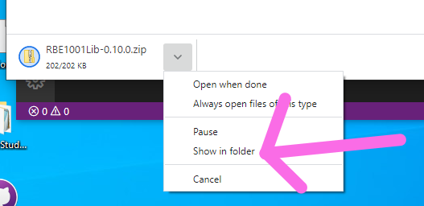
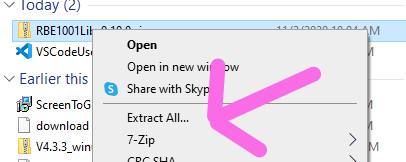
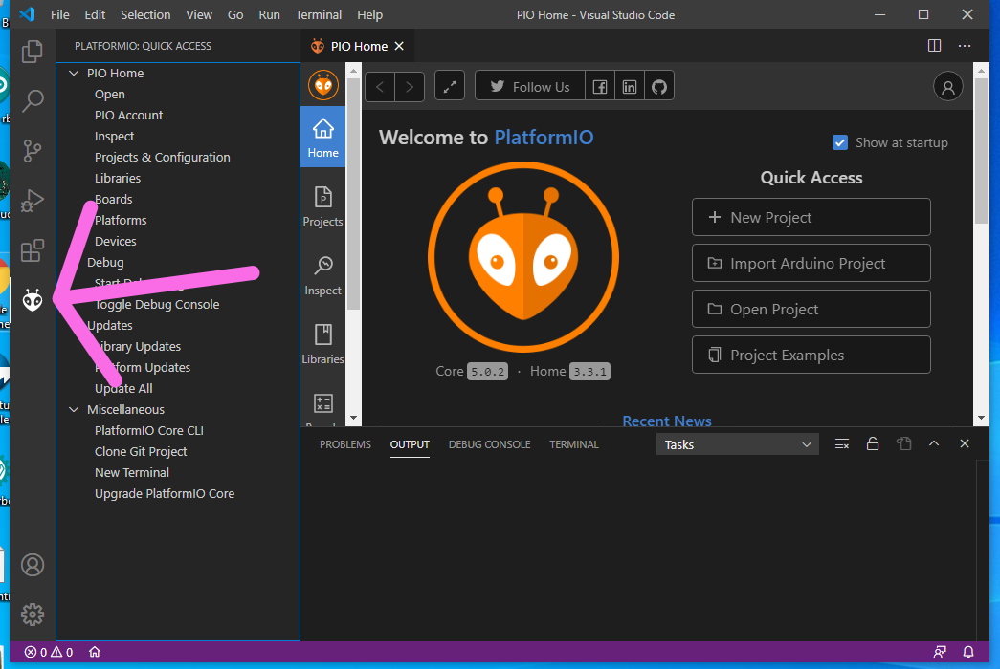
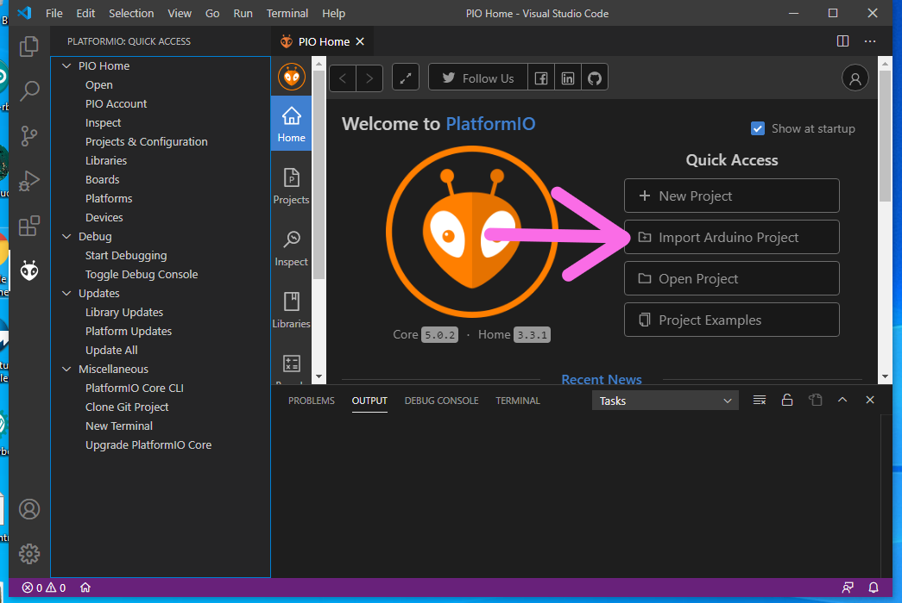
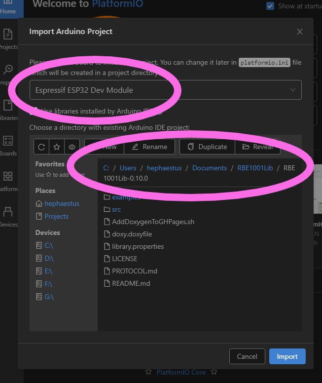
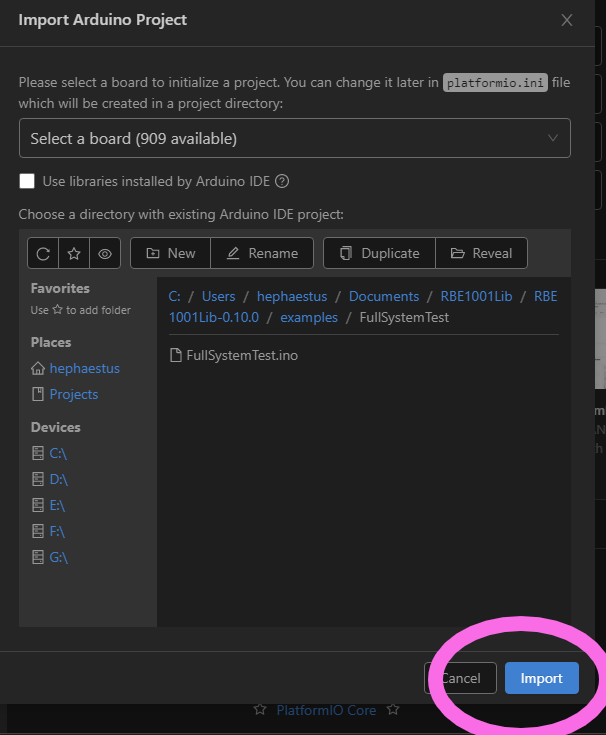

# ZenVSCodeInstaller
Instructions and Installer scripts for VSCode configured for use in the WPI robotics program

# Setup Instructions

## 1 install VSCode+Platformio

Find the installer for VSCode here:

https://code.visualstudio.com/

## 2 Open VSCode and Install PlatformIO

Open VSCode Extension Manager

Search for official `PlatformIO IDE` extension

Install `PlatformIO IDE`

Close VSCode to complete setup

## 3 Download the example code

[Source Code Zip for Latest RBE1001Lib](https://github.com/WPIRoboticsEngineering/RBE1001Lib/archive/0.10.0.zip)

Open the folder where you download the examples

Select Extract All

Extract to a known location, we recommend Documents\RBE1001Lib

## 4 Open an Example

Open VSCode and select the new PlatformIO Plugin Icon

Select Import Arduino Project

For the Board field set

`Espressif ESP32Dev Module`

And Navigate to the folder you used to extract the RBE1001Lib directory in Step 2

Navigate into the `examples` folder and select one, in this case `FullSystemTest`

Select Import

