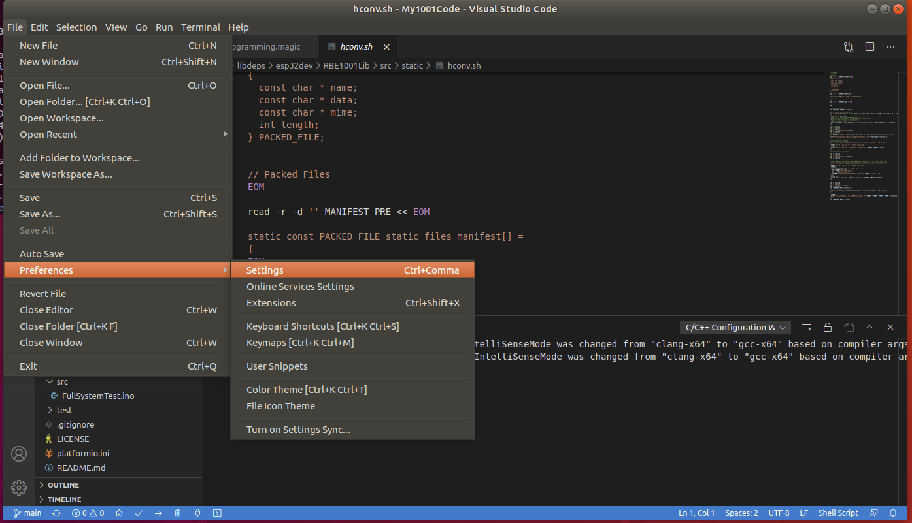
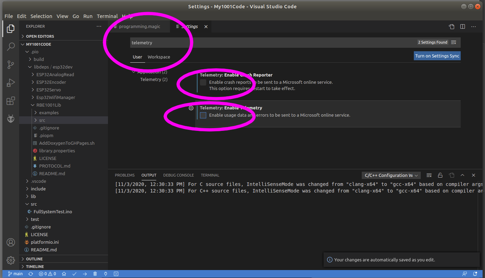
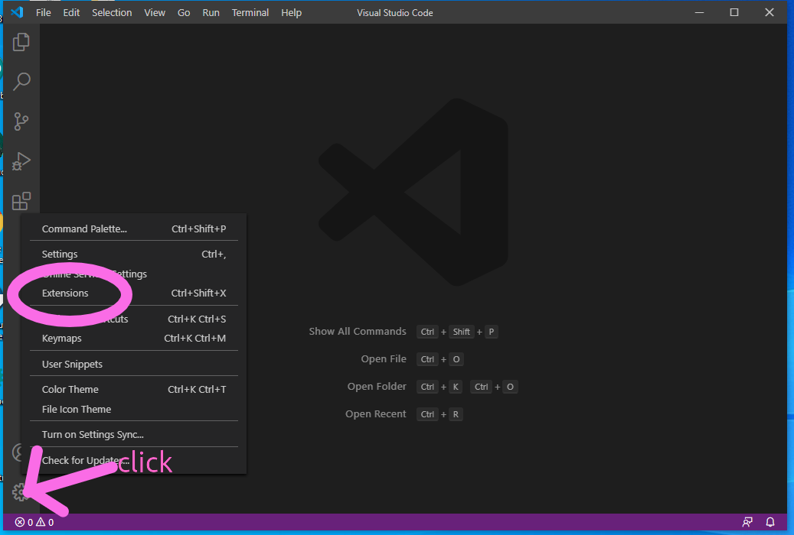
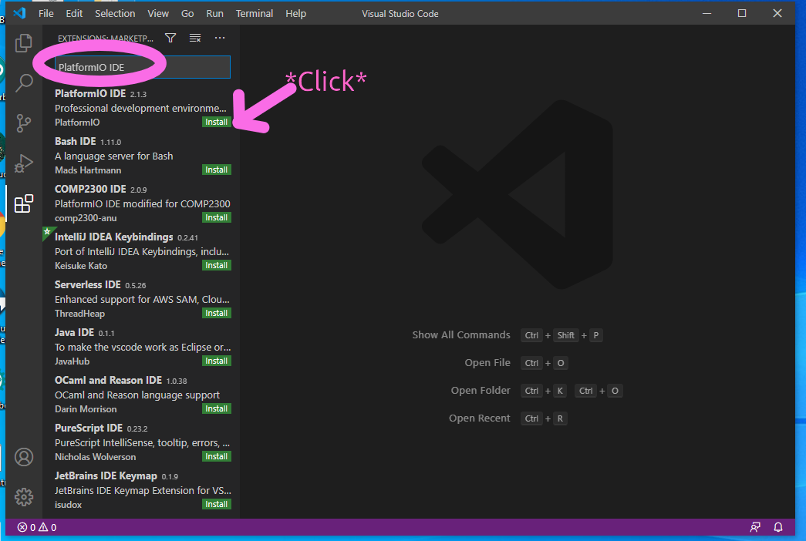
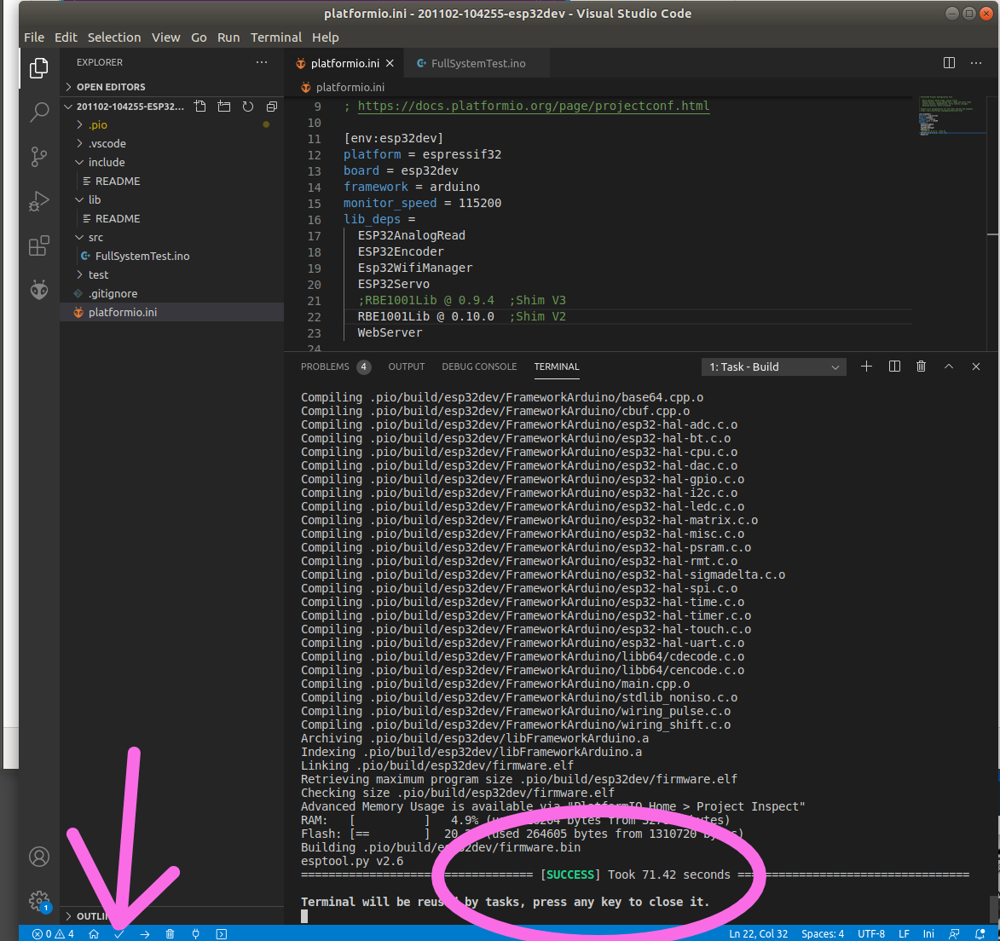
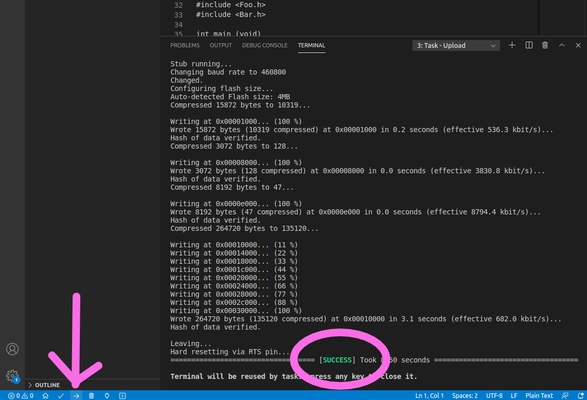

# Installing VSCode/platformio

Instructions and Installer scripts for VSCode configured for use in the WPI robotics program

# Setup Instructions

## 1) install VSCode

Find the installer for VSCode here:

https://code.visualstudio.com/

### 1.1) MacOS users ONLY

Install the Developer Command Line Tools from Apple (this is the thing that is currently broken). To do it you need to go to [developer.apple.com](https://developer.apple.com) and create an account. This is all pretty annoying, but it gets around the problem. Then navigate to the [download page for the tools](https://developer.apple.com/download/more). Check the boxes as shown on the sidebar (“Developer Tools” and “macOS”) as shown in the screen image above. Then download “Command Line Tools for Xcode 12”. It’s a pretty hefty download, but it should make everything work. After you download the tools, double click on the file in your Downloads folder to install.


Now you can run VSCode by hitting Command-Space, type in “visual studio Code”. 

## 2) Disable Private data leak

[Enabled by default per Secion 2.a of the user agreement: ](https://code.visualstudio.com/license)

```
DATA.
Data Collection.
The software may collect information about you and your use of the software, 

and send that to Microsoft. Microsoft may use this information to provide 

services and improve our products and services. You may opt-out of many of 

these scenarios, but not all, as described in the product documentation located

at https://code.visualstudio.com/docs/supporting/faq#_how-to-disable-telemetry-reporting.

There may also be some features in the software that may enable you and Microsoft 

to collect data from users of your applications. If you use these features, you

must comply with applicable law, including providing appropriate notices to users 

of your applications together with Microsoft’s privacy statement. Our privacy 

statement is located at https://go.microsoft.com/fwlink/?LinkID=824704. You can 

learn more about data collection and use in the help documentation and our privacy 

statement. Your use of the software operates as your consent to these practices.
```

From File > Preferences > Settings 

(macOS: Code > Preferences > Settings)



search for telemetry, and uncheck the `Telemetry: Enable Telemetry` setting. 



This will silence most private data leaks from VS Code going forward. Other leaks may come form plugins you install. It s not possible to stop all private data leaks with VSCode. 

### 2.1) Free Software opt-out option

If data privacy is important, use our [Eclipse+Sloeber](https://github.com/WPIRoboticsEngineering/RobotInterfaceBoard#arduino-and-the-esp32-toolchain-and-sloeber-eclipse) installers and instructions and use Sloeber instead of VSCode. 

## 3) Open VSCode and Install PlatformIO

Open VSCode Extension Manager



Search for official `PlatformIO IDE` extension



Install `PlatformIO IDE`

Close VSCode to complete setup

## 4) Open Your Starter Code

### 4.1) **Pro/Con of Example Code**

#### Pro

 * Quickly Open Examples
 * Quickly Test Hardware
 * Lots of different examples
 * Best for running code you don't intend to change
 * Choose this option while *building/testing* your robot
 
#### Con 

 * Difficult to collaborate with team
 * Difficult to share code with staff for online help
 * Impossible  to go back in time to a previous version  
 * Possible to lose all of the code 
 * Awkward to go download the source and open it (This is a VSCode limitation)
 * Difficult to find additional examples for other libraries (This is a VSCode limitation)
 
### 4.2) **Pro/Con of Git**

#### Pro

 * Project is pre-configured, no need to mess with the platform.ini or .gitignore
 * Easy to collaborate with team
 * Easy to share code with staff for online help
 * Version history of every committed change, you can always go back in time
 * Code backed up on a server and accessible to whole team
 * GitHub Desktop helps make the Git workflow understandable and merge conflicts easier to resolve
 * Best as the starter code for the Final Project
 * Choose this option while *programming* your robot
 
#### Con

 * Only the one example in the Template, the RCCTL example 
 * Git is one more thing to learn, although utterly essential long term, not required for 1001
 * Collaboration with teams meantelemetrys the possibility of merge conflicts/resolutions

### 4.3) Choose

either

[Follow these instructions for Examples as starter code](openExample.md)

or

[Follow these instructions for Git with a Template Repo of starter code](useGit.md)

## 5) Compile

Hit the compile (the little check mark) and verify that the example completes with `SUCCESS`



## 6) Upload code to ESP32

Hit the upload button (the little right arrow) and verify it completes with success



### 6.1) If you get anything other than success, install the driver for you system

[Esp32 Driver Windows](https://github.com/WPIRoboticsEngineering/ESP32ArduinoEclipseInstaller/releases/download/0.0.0/CP210x_Universal_Windows_Driver.zip)

[Esp32 Driver MacOS](https://github.com/WPIRoboticsEngineering/ESP32ArduinoEclipseInstaller/releases/download/0.0.0/SiLabsUSBDriverDisk.dmg)


