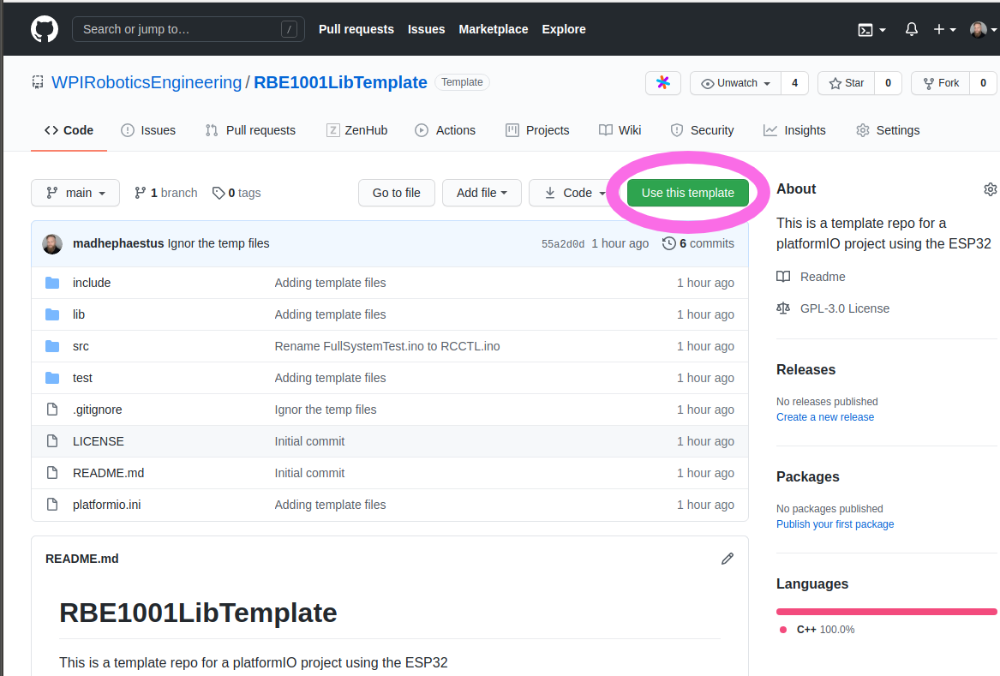
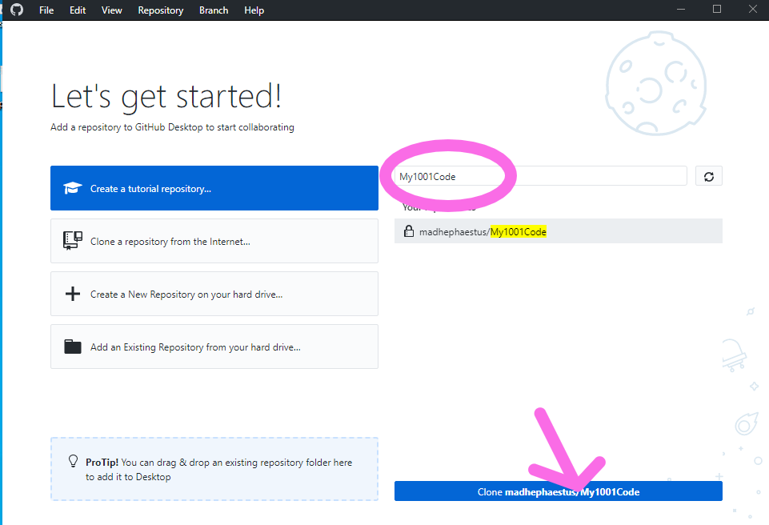

# Installing VSCode/platformio

Instructions and Installer scripts for VSCode configured for use in the WPI robotics program

# Setup Instructions

## 1) install VSCode+Platformio

Find the installer for VSCode here:

https://code.visualstudio.com/

### 1.1) MacOS users ONLY

Install the Developer Command Line Tools from Apple (this is the thing that is currently broken). To do it you need to go to [developer.apple.com](https://developer.apple.com) and create an account. This is all pretty annoying, but it gets around the problem. Then navigate to the [download page for the tools](https://developer.apple.com/download/more). Check the boxes as shown on the sidebar (“Developer Tools” and “macOS”) as shown in the screen image above. Then download “Command Line Tools for Xcode 12”. It’s a pretty hefty download, but it should make everything work. After you download the tools, double click on the file in your Downloads folder to install.


Now you can run VSCode by hitting Command-Space, type in “visual studio Code”. 


## 2) Open VSCode and Install PlatformIO

Open VSCode Extension Manager


Search for official `PlatformIO IDE` extension


Install `PlatformIO IDE`

Close VSCode to complete setup


## 3) Download the example code

[Source Code Zip for Latest RBE1001Lib](https://github.com/WPIRoboticsEngineering/RBE1001Lib/archive/0.10.0.zip)


Open the folder where you download the examples


Select Extract All


Extract to a known location, we recommend Documents\RBE1001Lib


## 4) Open an Example

### 4.1) Git Version Control

For Git Instruction skip here to Step 8 and do not do steps 4 or 5


Open VSCode and select the new PlatformIO Plugin Icon


Select Import Arduino Project


For the Board field set

`Espressif ESP32Dev Module`

And Navigate to the folder you used to extract the RBE1001Lib directory in Step 2


Navigate into the `examples` folder and select one, in this case `FullSystemTest`

Select Import


The first time you do this it will take a long time as PlatformIO needs to download and install the ESP32 toolchain.

## 5) Configure the projects libraries

Open the file `platformio.ini` in your new project and make the entire contents of the file read:

```
; PlatformIO Project Configuration File
;
;   Build options: build flags, source filter
;   Upload options: custom upload port, speed and extra flags
;   Library options: dependencies, extra library storages
;   Advanced options: extra scripting
;
; Please visit documentation for the other options and examples
; https://docs.platformio.org/page/projectconf.html

[env:esp32dev]
platform = espressif32
board = esp32dev
framework = arduino
monitor_speed = 115200
lib_deps =
  ESP32AnalogRead
  ESP32Encoder
  Esp32WifiManager
  ESP32Servo
  ;RBE1001Lib @ 0.9.4  ;Shim V3
  RBE1001Lib @ 0.10.0  ;Shim V2
  WebServer

```

### 5.1) V2 Shim Red Board

If you have the V2 shim, use the code above. 

### 5.2) V3 Shim Red Board

If you have the V3 shim, uncomment the line switching the library version to 0.9.4 and comment out the line for 0.10.0

## 6) Compile

Hit the compile (the little check mark) and verify that the example completes with `SUCCESS`


## 7) Upload code to ESP32

Hit the upload button (the little right arrow) and verify it completes with success


### 7.1) If you get anything other than success, install the driver for you system

[Esp32 Driver Windows](https://github.com/WPIRoboticsEngineering/ESP32ArduinoEclipseInstaller/releases/download/0.0.0/CP210x_Universal_Windows_Driver.zip)

[Esp32 Driver MacOS](https://github.com/WPIRoboticsEngineering/ESP32ArduinoEclipseInstaller/releases/download/0.0.0/SiLabsUSBDriverDisk.dmg)


## 8) Use GitHub to share code

First create a GitHub account if you haven't already.

Go to 

```
https://github.com/WPIRoboticsEngineering/RBE1001LibTemplate
```

and click on `Use this template`




Give the repo a name and **be sure to make it Private for school work**. 


## 9) Install GigHub Desktop

https://desktop.github.com/

Install and log in to github desktop. 

## 10) Search for and clone your new repository

Search for the repo you just created and clone it



Make note of *where* you cloned the files


## 11) Open Git Project in VSCode

Start by selecting Open Project (NOT Import or New)


Navigate to where GitHub desktop cloned the files


Use Steps 6 and 7 to verify everything.


## 12) Use GitHub Desktop to manage version control

For detailed instructions on how to use version control using GitHub desktop see these instructions

https://programminghistorian.org/en/lessons/retired/getting-started-with-github-desktop
