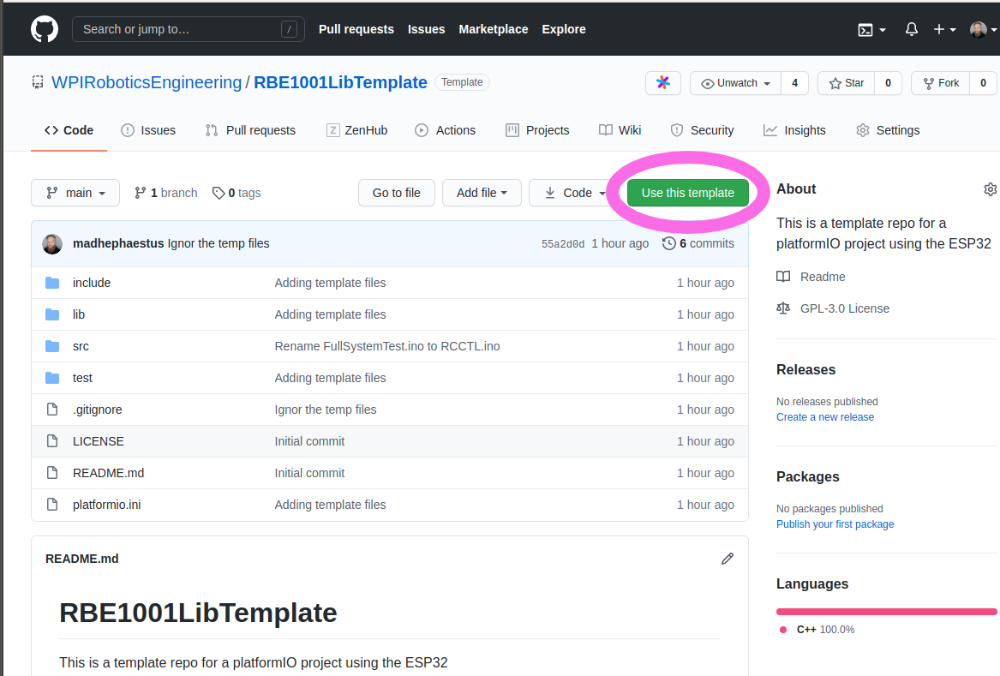
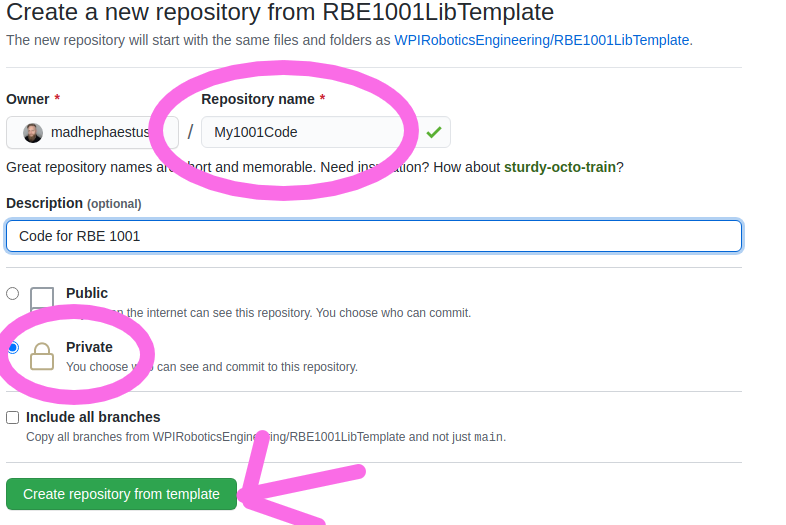
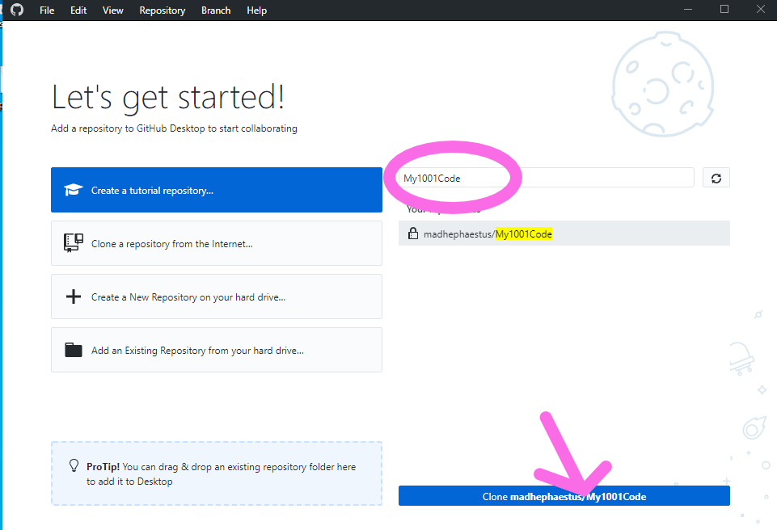
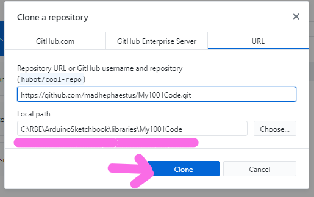
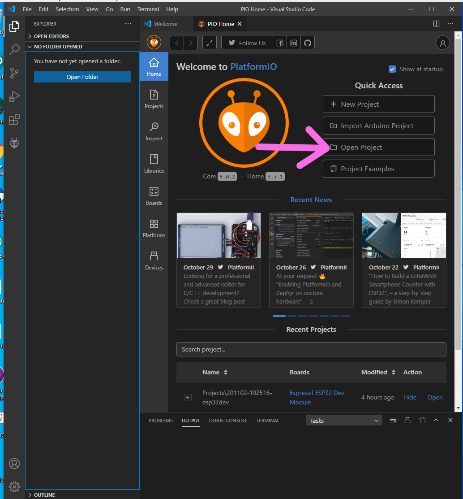
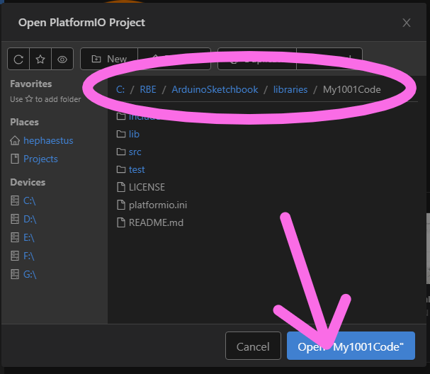

## 1) Use GitHub to share code

First create a GitHub account if you haven't already.

Go to 

```
https://github.com/WPIRoboticsEngineering/RBE1001LibTemplate
```

and click on `Use this template`




Give the repo a name and **be sure to make it Private for school work**. 



## 2) Install GigHub Desktop

https://desktop.github.com/

Install and log in to github desktop. 

## 3) Search for and clone your new repository

Search for the repo you just created and clone it



Make note of *where* you cloned the files



## 4) Open Git Project in VSCode

Start by selecting Open Project (NOT Import or New)



Navigate to where GitHub desktop cloned the files




## 5) Use GitHub Desktop to manage version control

For detailed instructions on how to use version control using GitHub desktop see these instructions

https://docs.github.com/en/free-pro-team@latest/desktop/contributing-and-collaborating-using-github-desktop
