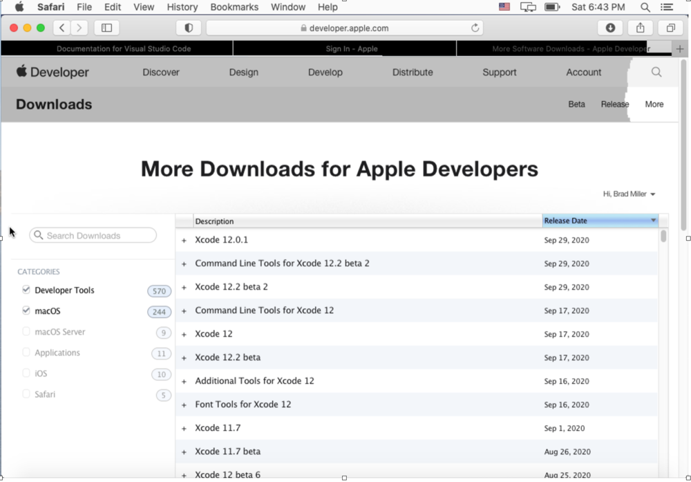
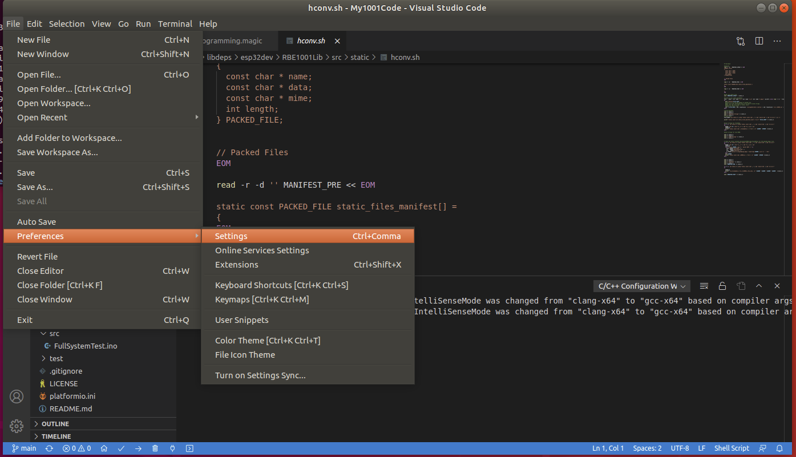
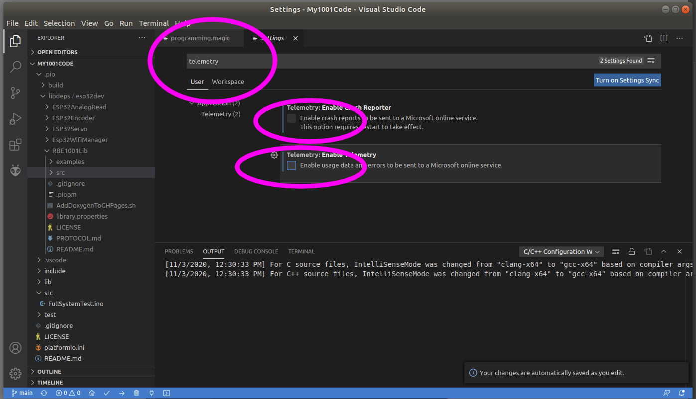

# Not Recommended!

These are the instructions to instal Microsoft VSCode. Microsoft has a very broad data gathering policy, and will leak private data on the first time you open the software, until the Telematry is disabled. More concerning is the fact that using the configuration to disable Telemetry does not entirely turn it off. 

The Microsoft version offers no additional features in exchange for this data leak.

If you already agreed to this data leak and want to use PlatfomrIO with your existing installation, here are the instructions. 

## 1) install VSCode

We assume you already installed it, if not, head to the [regular setup instructions](https://github.com/WPIRoboticsEngineering/ZenVSCodeInstaller#setup-instructions)


### 1.1) MacOS users ONLY

Install the Developer Command Line Tools from Apple (this is the thing that is currently broken). To do it you need to go to [developer.apple.com](https://developer.apple.com) and create an account. This is all pretty annoying, but it gets around the problem. Then navigate to the [download page for the tools](https://developer.apple.com/download/more). Check the boxes as shown on the sidebar (“Developer Tools” and “macOS”) as shown in the screen image above. Then download “Command Line Tools for Xcode 12”. It’s a pretty hefty download, but it should make everything work. After you download the tools, double click on the file in your Downloads folder to install.



Now you can run VSCode by hitting Command-Space, type in “visual studio Code”. 

## 2) Disable Private data leak

[Enabled by default per Secion 2.a of the user agreement: ](https://code.visualstudio.com/license)

```
DATA.
Data Collection.
The software may collect information about you and your use of the software, 

and send that to Microsoft. Microsoft may use this information to provide 

services and improve our products and services. You may opt-out of many of 

these scenarios, but not all, as described in the product documentation located

at https://code.visualstudio.com/docs/supporting/faq#_how-to-disable-telemetry-reporting.

There may also be some features in the software that may enable you and Microsoft 

to collect data from users of your applications. If you use these features, you

must comply with applicable law, including providing appropriate notices to users 

of your applications together with Microsoft’s privacy statement. Our privacy 

statement is located at https://go.microsoft.com/fwlink/?LinkID=824704. You can 

learn more about data collection and use in the help documentation and our privacy 

statement. Your use of the software operates as your consent to these practices.
```

From File > Preferences > Settings 

(macOS: Code > Preferences > Settings)



search for telemetry, and uncheck the `Telemetry: Enable Telemetry` setting. 



This will silence most private data leaks from VS Code going forward. Other leaks may come form plugins you install. It s not possible to stop all private data leaks with VSCode. 

### 2.1) Free Software opt-out option

If data privacy is important, use our [Eclipse+Sloeber](https://github.com/WPIRoboticsEngineering/RobotInterfaceBoard#arduino-and-the-esp32-toolchain-and-sloeber-eclipse) installers and instructions and use Sloeber instead of VSCode. 
